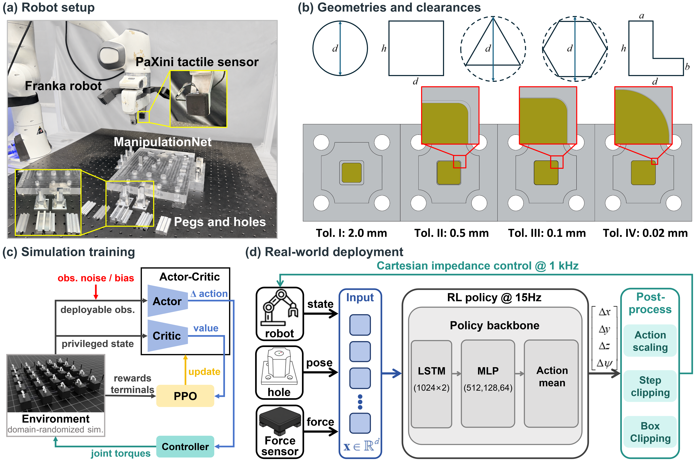
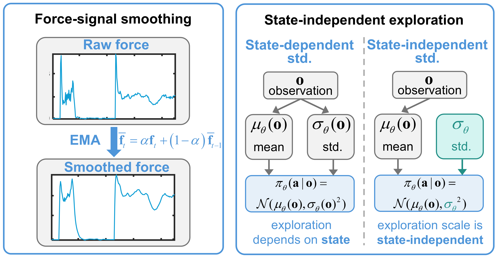

# InsertAnything

[](https://developer.nvidia.com/isaac/sim)
[](https://github.com/isaac-sim/IsaacLab)
[](https://www.python.org/)
[](LICENSE)
[](https://huggingface.co/tOMRmA/InsertAnything-checkpoints)

InsertAnything is an Isaac Lab project for force-conditioned, contact-rich peg-in-hole insertion in simulation and on a real Franka robot. It targets tight-clearance precision insertion, including Tol. IV settings with nominal clearance down to 0.02 mm.

The repository provides:

- Isaac Lab direct-RL environments for five fixed single-hole geometries.
- RL-Games training and evaluation scripts.
- Compact fingertip force feedback, reward shaping, and force logging.
- Stable force-conditioned training with force-signal smoothing and state-independent policy standard deviation.
- Real-robot closed-loop deployment utilities for calibrated Franka experiments.
- Optional single-hole smoke-test checkpoints hosted on Hugging Face.

The codebase accompanies the paper:

```text
InsertAnything: Generalizable Contact-Rich Precision Insertion from Simulation to Reality
```



**Figure 1.** Overview of the robot setup, standard geometries and clearances, simulation training, and force-conditioned real-world deployment evaluated in the accompanying paper.



**Figure 2.** InsertAnything stabilizes force-conditioned policy learning through exponential-moving-average force smoothing and a state-independent policy standard deviation.

## Highlights

- **Simulation-trained, real-robot deployed.** Policies are trained in Isaac Lab and deployed on a real Franka robot through calibrated target poses and deployable robot observations.
- **Force-conditioned insertion.** A compact three-axis force signal supports local contact-aware correction under target-pose bias and tight clearances.
- **Stable contact-rich RL.** Force-signal smoothing and state-independent policy standard deviation improve training stability when force observations change during contact transitions.
- **Single-hole task interface.** Each environment contains one fixed hole and one held peg, with geometry, tolerance, randomization, and observation settings defined explicitly in the task configuration.

## Project status

InsertAnything is organized as an external Isaac Lab extension. The simulation side is self-contained inside this repository, including open USD assets, task configurations, RL-Games training configurations, and checkpoint instructions. The real-robot side provides deployment code and configuration templates, but requires a compatible Franka control stack, a calibrated robot setup, and operator supervision.

## Installation

Install NVIDIA Isaac Sim and Isaac Lab first. Follow the official Isaac Lab repository and installation guide:

- [isaac-sim/IsaacLab](https://github.com/isaac-sim/IsaacLab)

The release was validated with Isaac Sim 5.0, Isaac Lab 2.2.1, and Python 3.11.

Then install InsertAnything:

```bash
python -m pip install -e source/InsertAnything
```

List the registered InsertAnything environments:

```bash
python scripts/list_envs.py
```

## Simulation experiments

Simulation tasks, reward settings, observation schemas, contact-force options, training commands, and evaluation commands are documented in:

- [Single-hole task README](source/InsertAnything/InsertAnything/tasks/direct/insertanything/README.md)

Example training command:

```bash
python scripts/rl_games/train.py --task InsertAnything-CircleHole-I-Direct-v0 --num_envs 128 --headless
```

Example evaluation command:

```bash
python scripts/rl_games/play.py \
  --task InsertAnything-LHole-III-Direct-v0 \
  --num_envs 128 \
  --headless \
  --checkpoint source/InsertAnything/InsertAnything/tasks/direct/insertanything/checkpoints/InsertAnything-LHole-III-Direct-v0.pth
```

Registered simulation tasks:

| Gym ID | Description |
| --- | --- |
| `InsertAnything-CircleHole-I-Direct-v0` | Circle hole, Tol. I |
| `InsertAnything-SquareHole-II-Direct-v0` | Square hole, Tol. II |
| `InsertAnything-LHole-III-Direct-v0` | L-shape hole, Tol. III |
| `InsertAnything-TriangleHole-IV-Direct-v0` | Triangle hole, Tol. IV |
| `InsertAnything-HexagonHole-III-Direct-v0` | Hexagon hole, Tol. III with fingertip force feedback |
| `InsertAnything-HexagonHole-IV-Direct-v0` | Hexagon hole, Tol. IV |

## Pretrained checkpoints

Optional checkpoints are hosted on Hugging Face:

- [InsertAnything checkpoints](https://huggingface.co/tOMRmA/InsertAnything-checkpoints)

Download the released checkpoints:

```powershell
hf download tOMRmA/InsertAnything-checkpoints InsertAnything-LHole-III-Direct-v0.pth `
  --repo-type model `
  --local-dir source/InsertAnything/InsertAnything/tasks/direct/insertanything/checkpoints

hf download tOMRmA/InsertAnything-checkpoints InsertAnything-HexagonHole-III-Direct-v0.pth `
  --repo-type model `
  --local-dir source/InsertAnything/InsertAnything/tasks/direct/insertanything/checkpoints
```

Checkpoint filenames, hashes, observation dimensions, and smoke-test commands are documented in the [checkpoint README](source/InsertAnything/InsertAnything/tasks/direct/insertanything/checkpoints/README.md).

Large checkpoint binaries are intentionally ignored by git.

## Real-robot deployment

The real-robot deployment code lives in:

```text
source/InsertAnything/InsertAnything/tasks/direct/insertanything/sim2real/
```

The main multi-episode closed-loop runner is:

```text
source/InsertAnything/InsertAnything/tasks/direct/insertanything/sim2real/run_multi_episode_closed_loop.py
```

It requires a calibrated target pose, a compatible Franka control server, and the sensor/control interfaces described in [the sim-to-real README](source/InsertAnything/InsertAnything/tasks/direct/insertanything/sim2real/README.md).

## License

InsertAnything is released under the BSD 3-Clause license. See [LICENSE](LICENSE).
